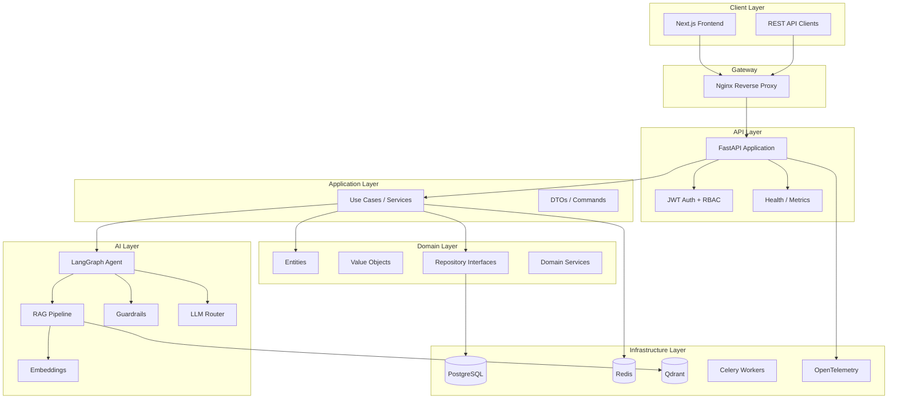

# Praello AI Knowledge Assistant for Businesses

Production-ready enterprise SaaS platform for AI-powered knowledge management, RAG, and agent orchestration.

**Repository:** [github.com/vittorioexp/praello-ai-knowledge-assistant-for-businesses](https://github.com/vittorioexp/praello-ai-knowledge-assistant-for-businesses)

## Architecture



## Layered Architecture

| Layer | Responsibility | Location |
|-------|---------------|----------|
| **API** | HTTP routes, middleware, dependency injection | `backend/src/enterprise_ai/api/` |
| **Application** | Use cases, orchestration, DTOs | `backend/src/enterprise_ai/application/` |
| **Domain** | Entities, value objects, business rules | `backend/src/enterprise_ai/domain/` |
| **Infrastructure** | DB, cache, external services | `backend/src/enterprise_ai/infrastructure/` |
| **AI** | LangGraph, RAG, embeddings, guardrails | `backend/src/enterprise_ai/ai/` |

## Tech Stack

**Backend:** Python 3.13, FastAPI, LangGraph, LangChain, OpenAI, Qdrant, PostgreSQL, SQLAlchemy, Alembic, Redis, Structlog

**Frontend:** Next.js 15, TypeScript, Tailwind CSS, shadcn/ui

**Infrastructure:** Docker Compose, Nginx, GitHub Actions, Pre-commit, Ruff, Black, Pytest

## Quick Start

### Prerequisites

- Docker & Docker Compose
- Python 3.13 (local development)
- Node.js 20+ (local development)

### 1. Clone and configure

```bash
cp .env.example .env
# Edit .env with your OpenAI API key and secrets
```

### 2. Start with Docker

```bash
docker compose up --build
```

Services:
- **Frontend:** http://localhost:3000
- **API:** http://localhost:8000/api/v1/docs
- **Nginx:** http://localhost

### 3. Local development (backend)

```bash
cd backend
pip install -e ".[dev]"
pytest tests/ -v
uvicorn enterprise_ai.main:app --reload
```

### 4. Database migrations

```bash
cd backend
alembic upgrade head
```

## Project Structure

```
├── backend/
│   ├── src/enterprise_ai/
│   │   ├── api/              # FastAPI routes, middleware
│   │   ├── application/      # Use cases, services, DTOs
│   │   ├── domain/           # Entities, value objects, ports
│   │   ├── infrastructure/   # DB, Redis, config, logging
│   │   └── ai/               # LangGraph, RAG, guardrails
│   ├── tests/
│   ├── alembic/
│   └── pyproject.toml
├── frontend/
│   └── src/app/
├── nginx/
├── docs/
├── examples/
├── docker-compose.yml
└── .github/workflows/
```

## Feature Roadmap

| # | Feature | Status |
|---|---------|--------|
| 1 | Foundation (Docker, health, DB, CI) | ✅ Complete |
| 2 | Authentication & RBAC | ✅ Complete |
| 3 | Knowledge Base (upload, chunk, embed) | ✅ Complete |
| 4 | RAG (hybrid search, reranking) | ✅ Complete |
| 5 | LangGraph Agent & Tools | ✅ Complete |
| 6 | LLMOps, Observability, Frontend | ✅ Complete |

## API Documentation

Interactive docs available at `/api/v1/docs` (Swagger) and `/api/v1/redoc` (ReDoc).

### Knowledge Base Endpoints

| Endpoint | Permission | Description |
|----------|------------|-------------|
| `POST /api/v1/documents/upload` | `documents:upload` | Upload PDF, DOCX, or Markdown |
| `GET /api/v1/documents` | `documents:read` | List documents (filter by status, tags) |
| `GET /api/v1/documents/{id}` | `documents:read` | Get document details |
| `POST /api/v1/documents/{id}/reindex` | `knowledge:admin` | Re-process and re-embed |
| `DELETE /api/v1/documents/{id}` | `documents:delete` | Delete document and vectors |

### RAG / Knowledge Query

| Endpoint | Permission | Description |
|----------|------------|-------------|
| `POST /api/v1/knowledge/query` | `knowledge:query` | Hybrid RAG query with citations |

### Agent Endpoints

| Endpoint | Permission | Description |
|----------|------------|-------------|
| `POST /api/v1/agent/conversations` | `agent:execute` | Send message to LangGraph agent |
| `POST /api/v1/agent/conversations/{id}/approve` | `agent:approve` | Approve pending tool action |
| `GET /api/v1/agent/conversations/{id}` | `agent:execute` | Get conversation checkpoint state |

### LLMOps Endpoints

| Endpoint | Permission | Description |
|----------|------------|-------------|
| `GET /api/v1/llm/usage` | `knowledge:admin` | Token usage and cost summary |
| `GET /api/v1/metrics` | Public | Prometheus metrics |

### Authentication Endpoints

| Endpoint | Description |
|----------|-------------|
| `POST /api/v1/auth/register` | Register a new user |
| `POST /api/v1/auth/login` | Login and receive JWT tokens |
| `POST /api/v1/auth/refresh` | Refresh access token |
| `GET /api/v1/auth/me` | Get current authenticated user |

### Health Endpoints

| Endpoint | Description |
|----------|-------------|
| `GET /api/v1/health/live` | Liveness probe |
| `GET /api/v1/health/ready` | Readiness probe (DB + Redis) |
| `GET /api/v1/metrics` | Prometheus metrics |

## RBAC Roles

| Role | Permissions |
|------|------------|
| `viewer` | Read documents, query knowledge |
| `contributor` | + Upload documents |
| `analyst` | + Execute/approve agents |
| `admin` | + Manage users, delete documents |
| `super_admin` | All permissions |

## Testing

```bash
cd backend
pytest tests/ -v --cov=src/enterprise_ai
```

## Deployment

See [docs/deployment.md](docs/deployment.md) for production deployment guide.

## License

MIT
