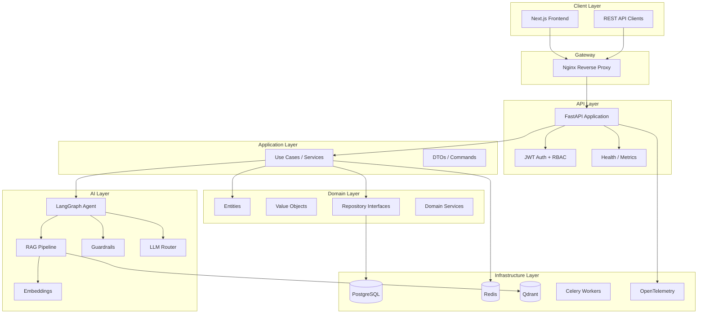

# Praello AI Knowledge Assistant for Businesses

Production-ready enterprise SaaS platform for AI-powered knowledge management, RAG, and agent orchestration.

**Repository:** [github.com/vittorioexp/praello-ai-knowledge-assistant-for-businesses](https://github.com/vittorioexp/praello-ai-knowledge-assistant-for-businesses)

## Large-scale collections

The platform is designed for very large, multi-terabyte enterprise repositories when
deployed with object storage (S3 or MinIO), PostgreSQL, Redis, and a
properly sized Qdrant cluster. Files are streamed instead of loaded fully into API memory;
ingestion runs asynchronously through Redis Streams, supports bounded retries and DLQ
replay, and can be scaled with independent workers. Connector sync is incremental for
Google Drive and SharePoint, while embeddings and vector upserts are batched.

For this scale, use S3 or MinIO rather than the local upload volume, separate ingestion
workers from API instances, size Qdrant for the resulting vector count, and enable
PostgreSQL/Redis high availability. The repository contains the scalability mechanisms,
but capacity is an infrastructure sizing concern, not a benchmark guarantee: throughput,
index size, embedding cost, recovery time, and query latency must be validated with a
representative load test before production rollout.

## Architecture


```mermaid
graph TB
    subgraph Client Layer
        WEB[Next.js Frontend]
        API_CLIENT[REST API Clients]
    end

    subgraph Gateway
        NGINX[Nginx Reverse Proxy]
    end

    subgraph API Layer
        FASTAPI[FastAPI Application]
        AUTH[JWT Auth + RBAC]
        HEALTH[Health / Metrics]
    end

    subgraph Application Layer
        UC[Use Cases / Services]
        DTO[DTOs / Commands]
    end

    subgraph Domain Layer
        ENT[Entities]
        VO[Value Objects]
        REPO_IF[Repository Interfaces]
        DOM_SVC[Domain Services]
    end

    subgraph AI Layer
        LG[LangGraph Agent]
        RAG[RAG Pipeline]
        EMB[Embeddings]
        GUARD[Guardrails]
        LLM[LLM Router]
    end

    subgraph Infrastructure Layer
        PG[(PostgreSQL)]
        REDIS[(Redis)]
        QDRANT[(Qdrant)]
        CELERY[Celery Workers]
        OTEL[OpenTelemetry]
    end

    WEB --> NGINX
    API_CLIENT --> NGINX
    NGINX --> FASTAPI
    FASTAPI --> AUTH
    FASTAPI --> HEALTH
    FASTAPI --> UC
    UC --> ENT
    UC --> REPO_IF
    UC --> LG
    LG --> RAG
    LG --> GUARD
    RAG --> EMB
    RAG --> QDRANT
    REPO_IF --> PG
    UC --> REDIS
    LG --> LLM
    FASTAPI --> OTEL
```

## Layered Architecture

| Layer | Responsibility | Location |
|-------|---------------|----------|
| **API** | HTTP routes, middleware, dependency injection | `backend/src/enterprise_ai/api/` |
| **Application** | Use cases, orchestration, DTOs | `backend/src/enterprise_ai/application/` |
| **Domain** | Entities, value objects, business rules | `backend/src/enterprise_ai/domain/` |
| **Infrastructure** | DB, cache, external services | `backend/src/enterprise_ai/infrastructure/` |
| **AI** | LangGraph, RAG, embeddings, guardrails | `backend/src/enterprise_ai/ai/` |

## Tech Stack

**Backend:** Python 3.13, FastAPI, LangGraph, LangChain, OpenAI, Qdrant, PostgreSQL, SQLAlchemy, Alembic, Redis, Structlog

**Frontend:** Next.js 16, React 19, TypeScript, Tailwind CSS, lucide-react

**Infrastructure:** Docker Compose, Nginx, GitHub Actions, Pre-commit, Ruff, Black, Pytest

## Quick Start

### Prerequisites

- Docker & Docker Compose
- Python 3.13 (local development)
- Node.js 20+ (local development)

### 1. Clone and configure

```bash
cp .env.example .env
# Edit .env with your OpenAI API key and secrets
```

### 2. Start with Docker

```bash
docker compose up --build
```

Services:
- **Frontend:** http://localhost:3000
- **API:** http://localhost:8000/api/v1/docs
- **Nginx:** http://localhost

### 3. Local development (backend)

```bash
cd backend
pip install -e ".[dev]"
pytest tests/ -v
uvicorn enterprise_ai.main:app --reload
```

### 4. Database migrations

```bash
cd backend
alembic upgrade head
```

### Storage and ingestion operations

Uploads use the local volume by default. For S3 or MinIO, set these variables in `.env`:

```dotenv
STORAGE_BACKEND=s3
S3_BUCKET=enterprise-ai-documents
S3_REGION=eu-west-1
S3_ENDPOINT_URL=
S3_ACCESS_KEY_ID=
S3_SECRET_ACCESS_KEY=
UPLOAD_MAX_SIZE_MB=5120
MAX_INGESTION_ATTEMPTS=5
```

The `ingestion-worker` service consumes Redis Streams jobs independently from the API. Jobs that fail after the configured number of attempts are written to `enterprise_ai:ingestion:dead-letter` for inspection and replay tooling.

The optional `connector-worker` runs external Drive/SharePoint synchronization. Configure `CONNECTOR_ORGANIZATION_ID` and `CONNECTOR_UPLOADED_BY` before starting Compose; its default interval is 15 minutes.

### Enterprise identity and access

OIDC and SAML SSO issue the platform's local JWT after validating the external identity. Configure SAML with the IdP entity ID, SSO URL, signing certificate, SP entity ID, and ACS URL. SCIM 2.0 provisioning is available under `/api/v1/scim/v2.0` and supports users, groups, filtering, pagination, replacement, patch operations, and deactivation.

Document ACLs are enforced during vector retrieval and support users, groups, nested SCIM group membership, organization links, and public links. Group membership resolution is tenant-scoped and cached briefly for query performance.

Example identity settings:

```dotenv
OIDC_ENABLED=false
SAML_ENABLED=false
SAML_IDP_ENTITY_ID=
SAML_IDP_SSO_URL=
SAML_IDP_X509_CERT=
SAML_SP_ENTITY_ID=praello-ai
SAML_ACS_URL=https://assistant.example.com/api/v1/auth/sso/saml/acs
SCIM_BEARER_TOKEN=
SCIM_ORGANIZATION_ID=
```

For frontend dependency verification, run `npm audit --omit=dev`, `npm run type-check`, and `npm run build` from `frontend/`. Production runtime dependencies currently report no known npm vulnerabilities.

## Project Structure

```
├── backend/
│   ├── src/enterprise_ai/
│   │   ├── api/              # FastAPI routes, middleware
│   │   ├── application/      # Use cases, services, DTOs
│   │   ├── domain/           # Entities, value objects, ports
│   │   ├── infrastructure/   # DB, Redis, config, logging
│   │   └── ai/               # LangGraph, RAG, guardrails
│   ├── tests/
│   ├── alembic/
│   └── pyproject.toml
├── frontend/
│   └── src/app/
├── nginx/
├── docs/
├── examples/
├── docker-compose.yml
└── .github/workflows/
```

## Feature Roadmap

| # | Feature | Status |
|---|---------|--------|
| 1 | Foundation (Docker, health, DB, CI) | ✅ Complete |
| 2 | Authentication & RBAC | ✅ Complete |
| 3 | Knowledge Base (upload, chunk, embed) | ✅ Complete |
| 4 | RAG (hybrid search, reranking) | ✅ Complete |
| 5 | LangGraph Agent & Tools | ✅ Complete |
| 6 | LLMOps, Observability, Frontend | ✅ Complete |

## API Documentation

Interactive docs available at `/api/v1/docs` (Swagger) and `/api/v1/redoc` (ReDoc).

### Knowledge Base Endpoints

| Endpoint | Permission | Description |
|----------|------------|-------------|
| `POST /api/v1/documents/upload` | `documents:upload` | Upload PDF, DOCX, or Markdown |
| `GET /api/v1/documents` | `documents:read` | List documents (filter by status, tags) |
| `GET /api/v1/documents/{id}` | `documents:read` | Get document details |
| `POST /api/v1/documents/{id}/reindex` | `knowledge:admin` | Re-process and re-embed |
| `DELETE /api/v1/documents/{id}` | `documents:delete` | Delete document and vectors |

### RAG / Knowledge Query

| Endpoint | Permission | Description |
|----------|------------|-------------|
| `POST /api/v1/knowledge/query` | `knowledge:query` | Hybrid RAG query with citations |

### Agent Endpoints

| Endpoint | Permission | Description |
|----------|------------|-------------|
| `POST /api/v1/agent/conversations` | `agent:execute` | Send message to LangGraph agent |
| `POST /api/v1/agent/conversations/{id}/approve` | `agent:approve` | Approve pending tool action |
| `GET /api/v1/agent/conversations/{id}` | `agent:execute` | Get conversation checkpoint state |

### LLMOps Endpoints

| Endpoint | Permission | Description |
|----------|------------|-------------|
| `GET /api/v1/llm/usage` | `knowledge:admin` | Token usage and cost summary |
| `GET /api/v1/metrics` | Public | Prometheus metrics |

### Authentication Endpoints

| Endpoint | Description |
|----------|-------------|
| `POST /api/v1/auth/register` | Register a new user |
| `POST /api/v1/auth/login` | Login and receive JWT tokens |
| `POST /api/v1/auth/refresh` | Refresh access token |
| `GET /api/v1/auth/me` | Get current authenticated user |

### Health Endpoints

| Endpoint | Description |
|----------|-------------|
| `GET /api/v1/health/live` | Liveness probe |
| `GET /api/v1/health/ready` | Readiness probe (DB + Redis) |
| `GET /api/v1/metrics` | Prometheus metrics |

## RBAC Roles

| Role | Permissions |
|------|------------|
| `viewer` | Read documents, query knowledge |
| `contributor` | + Upload documents |
| `analyst` | + Execute/approve agents |
| `admin` | + Manage users, delete documents |
| `super_admin` | All permissions |

## Testing

```bash
cd backend
pytest tests/ -v --cov=src/enterprise_ai
```

## Deployment

See [docs/deployment.md](docs/deployment.md) for production deployment guide.

## License

MIT
